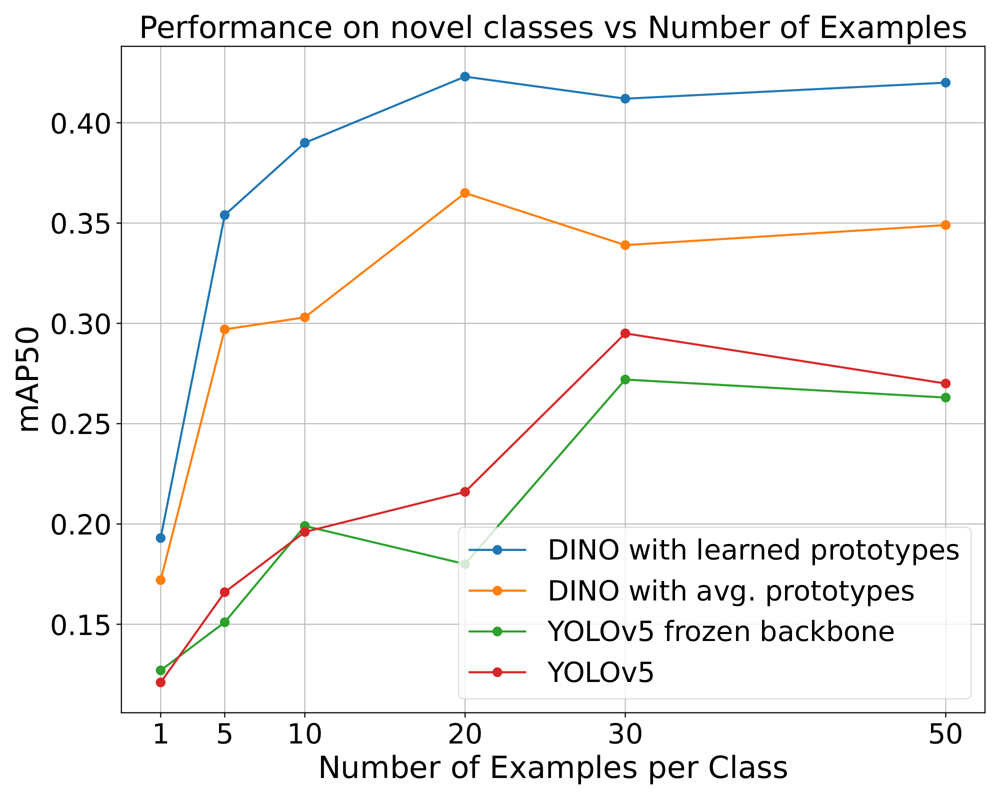

# Detecting Objects in Remote Sensing with Only a Few Examples

[Xavier Bou](https://www.linkedin.com/in/xavier-bou-hernandez-39b517134/), [Rafael Grompone](https://scholar.google.fr/citations?user=GLovf4UAAAAJ&hl=en), [Thibaud Ehret](https://tehret.github.io), [Gabriele Facciolo](http://gfacciol.github.io/), [Jean-Michel Morel](https://sites.google.com/site/jeanmichelmorelcmlaenscachan/)

Centre Borelli, ENS Paris-Saclay

---

[]()
[]()
[]()

This repository is the official PyTorch implementation of [NAME OF THE ARTICLE].

The goal of this paper is to perform object detection in satellite imagery with only a few examples, thus enabling users to specify any object class with minimal annotations. To this end, we explore recent methods and ideas from open-vocabulary detection for the remote sensing domain. We develop a few-shot object detector based on a traditional two-stage architecture, where the classification block is replaced by a prototype-based classifier. A large-scale pre-trained model is used to build class-reference embeddings or prototypes, which are compared to bounding box proposal contents for label prediction. In addition, we propose  fine-tuning class-reference embeddings on available training images to boost performance and learn the difference amongst similar classes, such as aircraft types. We perform extensive evaluations on multiple remote sensing datasets containing challenging and rare objects. Furthermore, we study the performance of both visual and image-text features, namely DINOv2 and CLIP, including two CLIP models specifically tailored for remote sensing applications. Our results indicate that [... extend when it's clear after all experiments].



## Contents

1. [Overview](#Overview)
1. [Data preparation](#Data-preparation)
1. [Create prototypes](#Create-prototypes)
1. [Fine-tune prototypes](#Fine-tune-prototypes)
1. [Evaluate](#Evaluate)
1. [Citation](#Citation)
1. [License and Acknowledgement](#License-and-Acknowledgement)

### Overview

### Data preparation

### Create prototypes

```Shell
bash scripts/create_prototypes_simd.sh
```

### Fine-tune prototypes

```Shell
bash scripts/train_simd.sh
```

### Evaluate

```Shell
bash scripts/eval_simd.sh
```

### Citation

### License and Acknowledgement

This project is released under the GPL-3.0 license.
